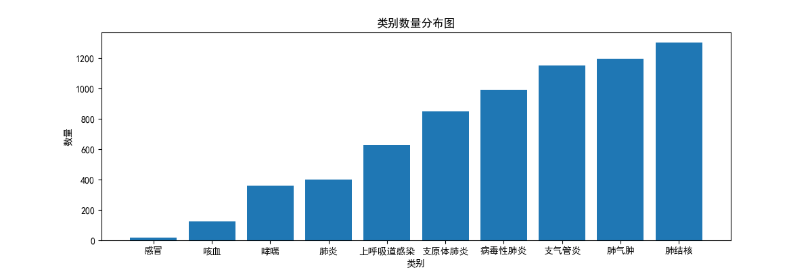
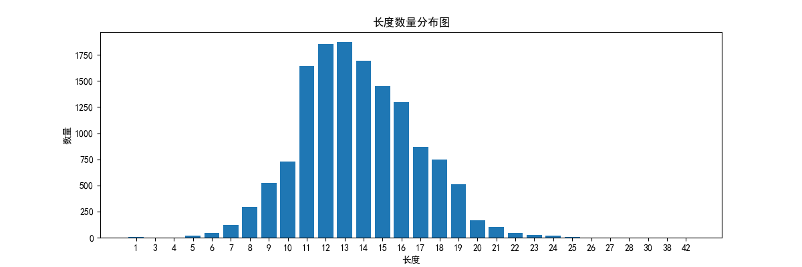

# 基于多机器学习模型对比的文本分类任务

- [X]  基本baseline-数据处理，模型训练，模型预测 -21/12/8
- [X]  详细数据集分析 -21/1/1
- [X]  模型调参优化 - 21/1/1
- [X]  导出训练结果 - 21/1/1

# 一，项目介绍

数据引用：[天池新冠问题数据](https://tianchi.aliyun.com/dataset/dataDetail?spm=5176.12281978.0.0.455f248bNzZ6Nf&dataId=76751)

## 1.原理

> 使用sklearn的机器学习算法对文本进行分类;通过数据分析查看数据分布，然后通过jieba的分词和gensim的word2vec获取词向量，最后通过决策树、随机森林、SVM进行训练验证，结果随机森林效果最好macro-F1分值为0.94

## 2.项目结构

```bash
│  analysis_data.py  # 首先执行，用于分析数据分布
│  W2V_train.py  # 第二个执行，用于生成词向量
│  method_comparison.py  # 第三个执行，用于模型训练
│  README.md
│
├─data  # 数据文件夹 
│      tianchi_data.csv
│
└─output  # 输出文件夹
        model.w2v
        result.txt
        类别数量分布图.png
        长度数量分布图.png
```

## 3.数据分布




# 二，使用项目

环境

```bash
gensim==4.1.2
jieba==0.42.1
matplotlib==3.3.4
numpy==1.20.1
pandas==1.2.4
scikit_learn==1.0.2
```

## 1.下载

`git clone git@github.com:eat-or-eat/ml-text-classify.git`

## 2.（选）如果改用自己的数据需要修改method_comparison.load_data()函数读取数据

## 3.运行

`python ./method_comparison.py`

打印示例:

```bash
模型：<class 'sklearn.svm._classes.SVC'> 
 耗时：0.703031s 
 结果：               precision    recall  f1-score   support

           0       0.60      0.34      0.44       111
           1       0.91      0.95      0.93       389
           2       0.79      0.85      0.82       324
           3       0.82      0.86      0.84       359
           4       0.70      0.58      0.63       250
           5       0.75      0.77      0.76       332
           6       0.43      0.68      0.53       182
           7       0.00      0.00      0.00        36
           8       0.94      0.60      0.73       123
           9       0.00      0.00      0.00         4

    accuracy                           0.75      2110
   macro avg       0.59      0.56      0.57      2110
weighted avg       0.75      0.75      0.74      2110
模型：<class 'sklearn.tree._classes.DecisionTreeClassifier'> 
 耗时：0.359445s 
 结果：               precision    recall  f1-score   support

           0       0.89      0.92      0.91       111
           1       0.97      0.97      0.97       389
           2       0.96      0.93      0.95       324
           3       0.92      0.95      0.93       359
           4       0.93      0.91      0.92       250
           5       0.97      0.91      0.94       332
           6       0.90      0.91      0.90       182
           7       0.82      0.92      0.87        36
           8       0.86      0.93      0.89       123
           9       0.50      1.00      0.67         4

    accuracy                           0.93      2110
   macro avg       0.87      0.94      0.90      2110
weighted avg       0.94      0.93      0.94      2110
模型：<class 'sklearn.ensemble._forest.RandomForestClassifier'> 
 耗时：2.172574s 
 结果：               precision    recall  f1-score   support

           0       0.94      0.90      0.92       111
           1       0.99      0.98      0.98       389
           2       0.97      0.95      0.96       324
           3       0.91      0.96      0.94       359
           4       0.93      0.91      0.92       250
           5       0.95      0.95      0.95       332
           6       0.92      0.97      0.94       182
           7       0.94      0.92      0.93        36
           8       0.94      0.85      0.89       123
           9       0.67      1.00      0.80         4

    accuracy                           0.95      2110
   macro avg       0.92      0.94      0.92      2110
weighted avg       0.95      0.95      0.95      2110

```
